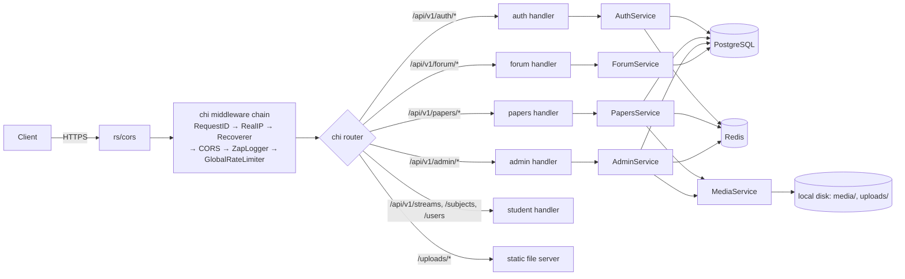
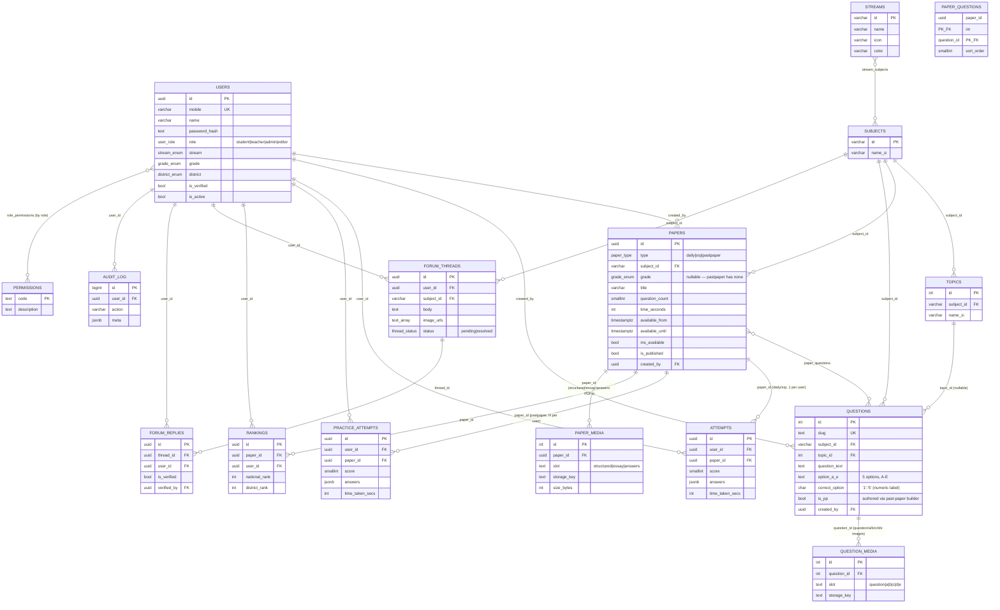

# Miedvance API

REST API for Miedvance, a Sri Lankan A/L (Advanced Level) exam-prep platform: daily MCQs, ranked
"SRP" papers, interactive past papers, a moderated Q&A forum, and island-wide/district rankings.

Written in Go. This service is the API-only half of the product — the web client lives in a
separate `frontend` repository (see [Cross-repo wiring](#cross-repo-wiring)).

## Tech stack

| Layer | Choice |
|---|---|
| Language | Go 1.25 |
| Router | [chi](https://github.com/go-chi/chi) v5 |
| Database | PostgreSQL 15, accessed via hand-written [pgx/v5](https://github.com/jackc/pgx) queries (no ORM, no sqlc codegen — see [Architecture notes](#architecture-notes)) |
| Cache / ephemeral state | Redis 7 via [go-redis/v9](https://github.com/redis/go-redis) |
| Auth | JWT ([golang-jwt/v5](https://github.com/golang-jwt/jwt)), bcrypt password hashes |
| Cron | [robfig/cron/v3](https://github.com/robfig/cron) |
| Logging | [zap](https://github.com/uber-go/zap) |
| Rate limiting | [ulule/limiter/v3](https://github.com/ulule/limiter) (in-memory) |
| CORS | [rs/cors](https://github.com/rs/cors) |

## Architecture

### Layers

```
cmd/server/main.go   — composition root: loads config, wires everything, starts the HTTP server
internal/
  config/            — env var loading + validation (internal/config/config.go)
  db/                — pgx pool construction
  redis/             — go-redis client construction
  model/             — domain structs shared across layers (internal/model/types.go)
  repository/        — SQL — one file per aggregate (auth, papers, practice, admin, forum, ...)
  service/           — business logic, orchestrates repositories + Redis + storage
  handler/           — HTTP layer: request parsing, response shaping, chi route trees
  middleware/         — auth (JWT), RBAC permission checks, rate limiting, request logging, static file serving
  cron/              — scheduled jobs (ranking, marking-scheme release, OTP cleanup)
  sms/               — SMS provider client (Dialog/Mobitel OTP delivery)
  storage/           — local-disk blob storage behind a small interface (swappable for S3 etc.)
  httputil/          — JSON response + structured `AppError` helpers
```

Each handler package composes a chi sub-router (`Routes()`), constructed with its service +
the shared `Auth` middleware, and mounted onto the root router in `main.go`.

### Request flow



Auth is stateless-JWT with a Redis-backed revocation list (see [Redis architecture](#redis-architecture)).
Admin/editor routes are additionally gated by a DB-backed, Redis-cached RBAC permission check
(`middleware.RequirePermission`, `permissions` / `role_permissions` tables).

### Key domain concept: papers as a unified exam engine

`papers.type` (`daily` | `srp` | `pastpaper`) drives one shared engine (`PapersService` +
`practice_attempts`/`attempts`) rather than three separate features:

- **daily** / **srp** — one attempt per (user, paper), pre-scheduled `available_from`/`available_until`,
  ranked via `rankings` once the window closes.
- **pastpaper** — many attempts per (user, paper) (`practice_attempts`, no uniqueness constraint),
  server-authoritative elapsed timing, no grade level, optional reference PDFs (`paper_media`).

MCQ correct answers are **never serialized to a student-facing response** — `model.Question.CorrectOption`
is tagged `json:"-"`; the marking-scheme/practice-review endpoints use a separate
`model.QuestionWithAnswer` type that does expose it, after eligibility checks.

## Database architecture

PostgreSQL 15. Schema is `sql/schema.sql` (base) plus **11 forward-only migrations** applied in
order (see [Migrations](#migrations) — there is no down-migration tooling).

### Entities & relationships



### Notable design points

- **`papers` ↔ `questions` is many-to-many** via `paper_questions(paper_id, question_id, sort_order)`.
  Questions live in a shared pool (`questions`) and are attached to one or more papers; deleting a
  question is blocked while any attachment exists (`ErrQuestionInUse`).
- **`streams` ↔ `subjects` is many-to-many** via `stream_subjects` (a subject like Chemistry can
  belong to both the Physical Science and Bio Science streams).
- **Answer labels are numeric** (`'1'`–`'5'`), matching real Sri Lankan past-paper answer keys —
  not the `'A'`–`'E'` internal option-column/image-slot names, which stayed as-is.
- **`is_pp`** on `questions` records provenance (authored via the past-paper builder vs. the
  general pool) as a default, but is user-editable on both editors — it does not by itself
  determine which papers reference the question (that's `paper_questions`).
- **Single-attempt vs. multi-attempt** is enforced structurally: `attempts` has
  `UNIQUE(user_id, paper_id)`; `practice_attempts` deliberately has no such constraint.
- **Images and PDFs are sparse, gated, and off the public upload path.** `question_media` /
  `paper_media` store only an opaque `storage_key` per (entity, slot) — rows exist only when a
  file is actually attached. Files live under the private `MEDIA_DIR` (never under `/uploads`)
  and are served through an authenticated/gated handler, **except** the past-paper `answers` PDF
  slot, which is intentionally open to any authenticated student on a published paper (it holds
  only structured/essay answers — MCQ keys are never in a servable file).
- **No soft deletes / no optimistic locking**, with two narrow exceptions: `forum_threads` and
  `forum_replies` carry `is_deleted` flags (moderation, not general soft-delete). Everything else
  is a hard `DELETE`, guarded at the service layer (e.g. `ErrQuestionInUse`) rather than by a
  deleted-at column or a row version/`xmin` check.
- **RBAC is DB-backed, not role-hardcoded.** `permissions` + `role_permissions` let `admin`/`editor`
  capabilities be data (seeded, then editable via `PUT /admin/roles/{role}/permissions`), checked
  per-request by `middleware.RequirePermission`, cached in Redis for 5 minutes.

### Migrations

There is no migration framework (no golang-migrate/goose/atlas) — each change is a plain, **hand-written,
forward-only, idempotent-where-possible** `.sql` file in `sql/`, applied manually and in filename
order after `sql/schema.sql`:

```
sql/schema.sql                        — base schema (users, otps, subjects, topics, papers,
                                         questions, attempts, rankings, forum, audit_log)
sql/migrate_admin.sql                 — editor role, permissions/role_permissions (RBAC),
                                         question pool model (paper_questions join table)
sql/migrate_streams.sql               — streams table + stream_subjects (M:M)
sql/migrate_subject_scoping.sql       — questions.subject_id becomes NOT NULL
sql/migrate_topics.sql                — questions.topic_id
sql/migrate_past_papers.sql           — paper_type 'pastpaper', paper_media, practice_attempts
sql/migrate_question_media.sql        — question_media (sparse question/option images)
sql/migrate_five_options_pp.sql       — questions.option_e, correct_option E, questions.is_pp
sql/migrate_numeric_options.sql       — correct_option + stored answers: A-E → 1-5
sql/migrate_paper_grade_nullable.sql  — papers.grade becomes nullable (past papers have none)
sql/migrate_answers_pdf.sql           — paper_media 'answers' slot
sql/migrate_drop_legacy_pastpapers.sql — drops the old pre-engine past_papers/pp_questions/pp_essays
```

Apply a migration with:

```bash
docker exec -i <postgres-container> psql -U $DB_USER -d $DB_NAME < sql/migrate_xyz.sql
```

`sql/seed_dummy_data.sql` is optional local sample data (subjects, topics, questions incl. past
papers, in Sinhala) — not part of the schema.

`sqlc.yaml` is present but currently unused — there is no `sql/queries/` directory and no
generated code; all repository queries are hand-written. Treat it as a stale artifact until/unless
sqlc codegen is reintroduced.

## Redis architecture

Redis is used purely as a **cache + ephemeral-state store** — nothing here is a system of record;
every key is either safe to lose (worst case: a cache miss or a slightly-too-early resend) or
re-derivable from Postgres.

| Key pattern | Purpose | TTL | Set by | Invalidated by |
|---|---|---|---|---|
| `bl:{jwt}` | Access/refresh token **blocklist** (revocation) | until the token's own expiry | logout; refresh (old token blocklisted, one-time-use) | natural TTL expiry only |
| `otp:cd:{mobile}:{purpose}` | OTP resend **cooldown** guard | `OTP_RESEND_COOLDOWN_SECONDS` (default 60s) | every OTP send (register/login/reset) | natural TTL expiry only |
| `perm:{role}` | Cached permission-code list for a role | `permCacheTTL` = 5 min | first permission check for that role | explicitly, after any `role_permissions` write (`PUT /admin/roles/{role}/permissions`) |
| `admin:subject_summary` | Cached subject-cards summary (counts) | `subjectSummaryTTL` = 5 min | first read of the admin subjects summary | explicitly, after any subject/topic/paper/question write that changes counts |
| `lb:{paperID}:{district\|"all"}:{page}:{limit}` | Cached leaderboard page for a paper | `lbTTL` = 5 min | first read of that leaderboard page/filter combo | explicitly, via `Scan`-then-`Del` of `lb:{paperID}:*` — triggered after ranking recompute (cron and manual `POST /admin/papers/{id}/trigger-rankings`) |

Notes:
- All TTLs are a **safety net**; the "invalidated by" column is the primary invalidation path —
  writes call an explicit `Del`/pattern-`Scan`+`Del`, not just "wait for TTL".
- The leaderboard cache is invalidated with `SCAN` (cursor-based, 100 keys/batch) rather than
  `KEYS`, to avoid blocking Redis on a large keyspace.
- Rate limiting (`GlobalRateLimiter`, `OTPRateLimiter`, `LoginRateLimiter`) is **in-memory**
  (ulule/limiter's memory store), not Redis-backed — it resets on process restart and does not
  coordinate across multiple API replicas. If you deploy more than one API instance, this is a
  gap to be aware of (rate limits become per-instance, not global).

## Setup

### Prerequisites

- Go 1.25+
- PostgreSQL 15
- Redis 7
- (optional) Docker + Docker Compose for the containerized path

### Environment variables

Copy `.env.example` to `.env` and fill in the required ones. `NODE_ENV` (kept from this
service's Node.js predecessor) controls both the config loader's `.env` auto-load behavior and
the logger format.

| Variable | Default | Required | Description |
|---|---|---|---|
| `PORT` | `3000` | | HTTP listen port |
| `NODE_ENV` | `development` | | `production` disables `.env` auto-loading and switches logging to JSON + file output |
| `DB_HOST` | `localhost` | | PostgreSQL host |
| `DB_PORT` | `5432` | | PostgreSQL port |
| `DB_NAME` | `miedvance` | | Database name |
| `DB_USER` | `miedvance_user` | | DB username |
| `DB_PASSWORD` | — | **Yes** | DB password |
| `REDIS_URL` | `redis://localhost:6379` | | Redis connection URL |
| `JWT_SECRET` | — | **Yes (≥32 chars)** | HMAC secret for access tokens |
| `JWT_EXPIRES_IN` | `30d` | | Access token lifetime (`30d`, `24h`, or any Go duration string) |
| `JWT_REFRESH_SECRET` | = `JWT_SECRET` | | HMAC secret for refresh tokens |
| `JWT_REFRESH_EXPIRES_IN` | `30d` | | Refresh token lifetime |
| `SMS_PROVIDER` | `dialog` | | SMS provider identifier |
| `SMS_API_URL` | — | | Dialog/Mobitel SMS API endpoint |
| `SMS_API_KEY` | — | | SMS API key |
| `SMS_SENDER_ID` | `MIEDVANCE` | | SMS sender name |
| `UPLOAD_DIR` | `./uploads` | | **Public** upload root, served at `/uploads/*` (e.g. forum images) |
| `MAX_FILE_SIZE_MB` | `10` | | Upload size limit for non-image files (PDFs) |
| `MEDIA_DIR` | `./media` | | **Private** root for gated exam/question/paper images & PDFs — never served statically |
| `MAX_IMAGE_SIZE_MB` | `5` | | Upload size limit for question/option images |
| `CORS_ORIGIN` | `http://localhost:8080` | | Comma-separated list of allowed frontend origins |
| `OTP_EXPIRE_MINUTES` | `5` | | OTP validity window |
| `OTP_RESEND_COOLDOWN_SECONDS` | `60` | | Redis cooldown between OTP resends |
| `OTP_MAX_ATTEMPTS` | `5` | | Max wrong OTP attempts before an OTP is rejected |
| `ADMIN_MOBILE` | — | | Mobile number for the auto-seeded super-admin (skipped if unset) |
| `ADMIN_PASSWORD` | — | | Password for the auto-seeded super-admin (skipped if unset) |

`MEDIA_DIR` and `MAX_IMAGE_SIZE_MB` are read by `internal/config/config.go` but are **not** listed
in `.env.example` — add them there if you rely on non-default values.

### Install & run — local

```bash
# 1. Install Go deps
go mod download

# 2. Copy and edit environment
cp .env.example .env

# 3. Create the database, then apply schema + all migrations in order
psql -U postgres -c "CREATE DATABASE miedvance; CREATE USER miedvance_user WITH PASSWORD 'yourpw';"
psql -U miedvance_user -d miedvance -f sql/schema.sql
for f in sql/migrate_*.sql; do psql -U miedvance_user -d miedvance -f "$f"; done

# 4. (optional) local sample data
psql -U miedvance_user -d miedvance -f sql/seed_dummy_data.sql

# 5. Start Redis
redis-server

# 6. Run (loads .env automatically outside NODE_ENV=production)
make run          # = go run ./cmd/server
```

The super-admin account is auto-created on startup from `ADMIN_MOBILE` / `ADMIN_PASSWORD` if it
doesn't already exist (`repository.SeedAdmin`).

### Install & run — Docker

```bash
cp .env.example .env        # fill in DB_PASSWORD and JWT secrets
make docker-up               # docker-compose up --build: api + postgres + redis
curl http://localhost:4000/health
```

`docker-compose.yml` is a **development** compose file: it builds `Dockerfile.dev` (Go + [air](https://github.com/air-verse/air)
live-reload, port `4000`), auto-applies `sql/schema.sql` on first Postgres boot via
`docker-entrypoint-initdb.d`, and does **not** apply the `sql/migrate_*.sql` files automatically —
run those manually the same way as local setup, against the `postgres` service. There is no
production compose file; `Dockerfile` (see [Deployment](#deployment)) is the production build path.

### Test

```bash
make test          # go test ./... -timeout 60s — unit tests only
make test-race     # + -race (Linux/macOS; requires CGO_ENABLED=1)
```

Integration tests are behind a build tag and require a real Postgres:

```bash
TEST_DATABASE_URL="postgres://miedvance_user:<pw>@localhost:5432/miedvance?sslmode=disable" \
  go test -tags=integration ./internal/service/ -v
```

### Lint

```bash
make lint    # go vet ./...
```

## API

- **Base URL**: `http://localhost:3000/api/v1` in development (see `PORT`).
- **Versioning**: single implicit version, `/api/v1` — no version negotiation.
- **Auth model**: Bearer JWT. `Authorization: Bearer <token>` is checked first; if absent, the
  middleware falls back to an httpOnly cookie named `token` (set by the Next.js frontend's BFF —
  see [Cross-repo wiring](#cross-repo-wiring)), so this API also works directly from non-browser
  clients that just send the header.
- **OpenAPI/Swagger**: none exists in this repo. The tables below (and the handler `Routes()`
  functions in `internal/handler/`) are the source of truth.

### Auth `/api/v1/auth`

| Method | Path | Auth | Rate limit |
|---|---|---|---|
| POST | `/register` | — | OTP limiter (10/15min) |
| POST | `/verify-otp` | — | OTP limiter |
| POST | `/login` | — | Login limiter (20/15min) |
| POST | `/logout` | Bearer | — |
| POST | `/resend-otp` | — | OTP limiter |
| POST | `/forgot-password` | — | OTP limiter |
| POST | `/reset-password` | — | OTP limiter |
| POST | `/refresh` | — | — |
| GET/PATCH | `/me` | Bearer | — |

### Papers `/api/v1/papers` (daily, SRP, and past papers — one engine)

| Method | Path | Auth |
|---|---|---|
| GET | `/` | Bearer |
| GET | `/practice-list` | Bearer |
| GET | `/{id}/overview` | Bearer |
| POST | `/{id}/start` | Bearer |
| POST | `/{id}/submit` | Bearer |
| GET | `/{id}/questions/{qid}/media/{slot}` | Bearer |
| GET | `/{id}/practice/overview` | Bearer |
| POST | `/{id}/practice/start` | Bearer |
| POST | `/{id}/practice/{attemptId}/submit` | Bearer |
| GET | `/{id}/practice/attempts` | Bearer |
| GET | `/{id}/pdf/{slot}` | Bearer |
| GET | `/{id}/marking-scheme` | Bearer |
| GET | `/{id}/rankings` | Bearer |
| POST | `/` | Admin |
| PATCH | `/{id}/marking-scheme` | Admin |

### Admin `/api/v1/admin` (permission-gated — see [RBAC](#notable-design-points))

Streams/subjects/topics summary reads (`GET /streams`, `/subjects`, `/subjects/summary`,
`/streams/{id}/subjects`) require only authentication. Everything else requires a specific
permission code (`papers:create`, `papers:edit`, `papers:delete`, `papers:publish`,
`questions:create`, `questions:edit`, `questions:delete`, `topics:*`, `users:manage`, `rankings:trigger`,
checked per-route): dashboard stats, paper CRUD + publish + question attach/detach/reorder,
question-pool CRUD, question/paper media upload-serve-delete, streams/subjects/topics CRUD,
RBAC permission management, and user role/status management.

### Forum `/api/v1/forum`

| Method | Path | Auth |
|---|---|---|
| GET | `/threads` | Bearer |
| POST | `/threads` | Bearer (multipart, up to 3 images) |
| GET | `/threads/{id}` | Bearer |
| POST | `/threads/{id}/replies` | Bearer |
| PATCH | `/replies/{id}/verify` | Teacher/Admin |

### Reference data `/api/v1/streams`, `/api/v1/subjects`, `/api/v1/users`

Public stream/subject listing + subject detail; `/users/me/stats` for the logged-in student.

### Health

```
GET /health   → 200 {"status":"ok","timestamp":"...","env":"..."}
              → 503 {"status":"degraded","error":"..."}   (DB unreachable)
```

## Cron jobs

All UTC; registered in `internal/cron/jobs.go`, run in-process (no external scheduler).

| Schedule (UTC) | SLST equivalent | Job | Description |
|---|---|---|---|
| `*/5 * * * *` | — | SRP ranking | Rank SRP papers whose `available_until` closed in the last 5 min |
| `25 18 * * *` | 23:55 | Daily MCQ ranking | Rank daily papers |
| `30 18 * * *` | 00:00 | Marking scheme release | Release marking schemes for papers whose window has closed |
| `0 1 * * *` | 06:30 | OTP cleanup | Delete expired OTP rows older than 1 hour |

## Logging

- **Development**: colored console output via `zap.NewDevelopment()`.
- **Production** (`NODE_ENV=production`): JSON to stdout **and** to `logs/combined.log` (Info+)
  and `logs/error.log` (Error+). Rotation is left to the platform (Docker `--log-opt max-size` or
  `logrotate(8)` on bare metal) — the process does not rotate files itself.

## Deployment

### Docker build (production)

```bash
docker build -t miedvance-api .
docker run -p 3000:3000 --env-file .env miedvance-api
```

`Dockerfile` is a two-stage build: `golang:1.25-alpine` compiles a static
(`CGO_ENABLED=0`) binary, copied into a minimal `alpine:3.20` runtime image (`ca-certificates` +
`tzdata` only). It creates `uploads/`, `media/`, `logs/` inside the image and declares a container
`HEALTHCHECK` against `GET /health` (30s interval).

### Required environment

All non-optional variables from the [env-var table](#environment-variables) — at minimum
`DB_*`, `JWT_SECRET`, `CORS_ORIGIN` set to the deployed frontend's origin, and `ADMIN_MOBILE`/`ADMIN_PASSWORD`
if you want a bootstrap admin account created automatically. Postgres and Redis are **not**
bundled in the production Dockerfile — provision them separately (or reuse `docker-compose.yml`'s
`postgres`/`redis` service definitions as a starting point) and apply `sql/schema.sql` +
`sql/migrate_*.sql` before first boot.

### Health & readiness

`GET /health` doubles as both liveness and readiness: it pings the Postgres pool and returns 503
if the database is unreachable. There is no separate `/ready` endpoint.

### Graceful shutdown

`main.go` traps `SIGTERM`/`SIGINT`, calls `http.Server.Shutdown` with a 10s timeout, then closes
the Postgres pool and Redis client via deferred `Close()` calls, and stops the cron scheduler
(`Scheduler.Stop()` blocks until in-flight jobs finish). Standard `read`/`write`/`idle` timeouts
are 15s/30s/60s.

### Cross-repo wiring

This API is deployed independently from the frontend. The contract between them:

| Concern | Backend side | Frontend side |
|---|---|---|
| Allowed browser origins | `CORS_ORIGIN` (comma-separated) must include the frontend's deployed origin | frontend calls the API relative to itself via a rewrite/BFF, not a hardcoded cross-origin URL — see `frontend/README.md` |
| Auth cookie | Accepts a `token` cookie as a fallback to the `Authorization: Bearer` header (`extractBearer` in `internal/middleware/auth.go`) | sets that httpOnly `token` cookie after login/OTP-verify |
| API base URL | Exposes `/api/v1/*` at whatever host:port `PORT` binds to | frontend's `BACKEND_URL` / `NEXT_PUBLIC_API_URL` must point at that host |
| Response shapes / types | Go structs in `internal/model/types.go` are the source of truth | frontend's `src/types/*.ts` are **hand-maintained mirrors** — there is no shared/generated type package. Any field rename, added/removed field, or enum change here must be manually replicated there once the repos split (see the frontend README's open questions) |

There is **no OpenAPI spec, no code-generation step, and no shared package** between the two
repos today — the API tables above and the handler source are the only contract documentation.
Consider this the top risk to the split: keep an eye on drift once the two repos can no longer be
grepped together.

## Architecture notes

| Decision | Why |
|---|---|
| chi router | Stdlib-compatible, minimal |
| Hand-written pgx queries, no sqlc codegen in the loop | Full control per query; `sqlc.yaml` exists but is currently unused (no `sql/queries/`) |
| UUID scanned as string in some paths | Avoids pgtype codec complexity in a few call sites |
| `redisclient` package name | Avoids import collision with `go-redis/v9`'s `redis` package alias |
| Refresh tokens are one-time-use | Old refresh token is blocklisted on every use |
| `AppError` pattern (`httputil.E`) | Services return structured errors with an HTTP status baked in; handlers don't need per-error switch statements |
| Async ranking goroutine | Submit returns immediately; ranking recompute happens after, off the request path |
| Disk-local storage (`storage.Storage` interface) | Simple today; the interface exists specifically so S3/GCS can be swapped in without touching call sites — needed for any multi-replica deployment, since local disk isn't shared across instances |
| In-memory rate limiting | Simple, zero extra infra; **not** shared across replicas — see [Redis architecture](#redis-architecture) note |
