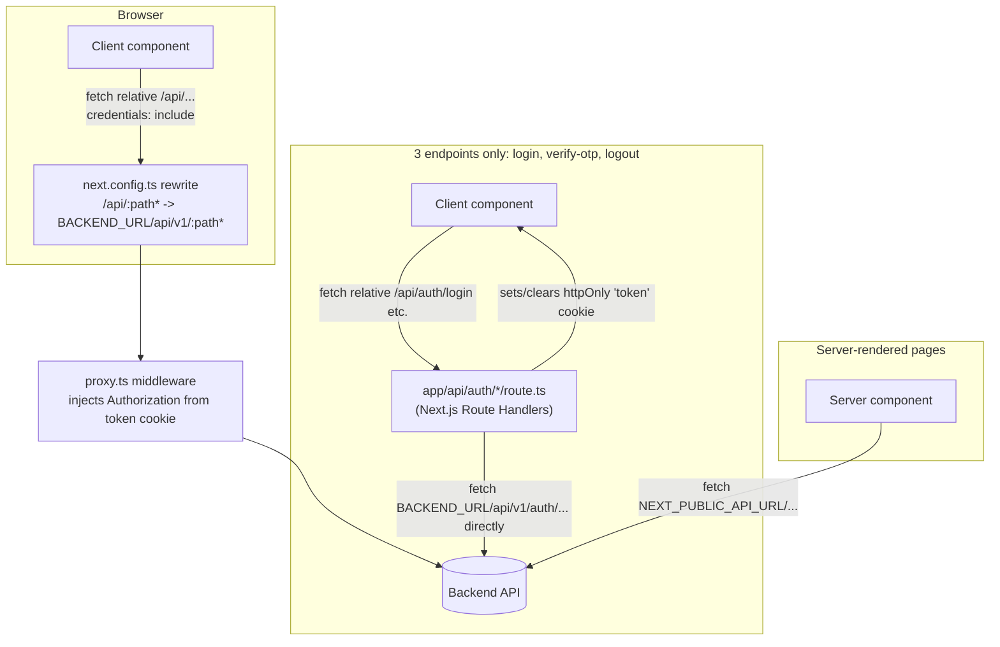

# Miedvance Web

The student/admin web client for Miedvance, a Sri Lankan A/L (Advanced Level) exam-prep platform:
daily MCQs, ranked "SRP" papers, interactive past papers, a moderated Q&A forum, and
island-wide/district rankings. Content and UI copy are in Sinhala.

Built with Next.js. This is the frontend-only half of the product — the API lives in a separate
`backend` repository (see [Cross-repo wiring](#cross-repo-wiring)).

## Tech stack

| Layer | Choice |
|---|---|
| Framework | Next.js 16 (App Router), React 19 |
| Language | TypeScript 5 |
| Styling | Tailwind CSS v4 (`@theme` design tokens in `globals.css`) |
| i18n | [next-intl](https://next-intl.dev/) — single locale (`si`, Sinhala) |
| Package manager | pnpm |
| Fonts | `next/font/google` — Manrope, Space Grotesk, Noto Sans Sinhala (self-hosted at build time) |
| Icons | lucide-react |

There is no test runner configured (`package.json` has no `test` script and no test framework is
installed) and no state-management library — auth/toast state is plain React
`useReducer`/Context (`src/providers/`).

## Architecture

### Structure

```
src/
  app/
    layout.tsx              — root layout: fonts, NextIntlClientProvider, AuthProvider, ToastProvider
    template.tsx             — remounts per navigation; wraps children in a CSS page-fade
    page.tsx                 — home page
    globals.css               — Tailwind + design tokens (@theme) + base/interaction styles
    login/, register/         — auth pages (own chrome, no shared layout)
    (app)/                    — route group: legacy top-navbar chrome
      layout.tsx
      forum/
    (student)/                — route group: student app shell
      dashboard/
      subject/[subjectId]/    — per-subject area (own layout: sidebar)
    admin/                     — admin app shell (own auth-gated layout)
      dashboard/, papers/, papers/[id]/, papers/new/, papers/daily/, papers/srp/,
      papers/pastpaper/, questions/, subjects/, users/
    api/auth/                  — BFF route handlers (login, verify-otp, logout) — see below
  components/
    ui/                        — Button, Card, Modal, Input, Badge, Pagination, ProgressBar, AdminDialog
    layout/                    — Navbar, HomeNavbar, Footer
    home/                      — landing page pieces (HeroOrb, HeroBg, CountdownTimer, SubjectGrid, DashboardHero)
    admin/                     — AdminSidebar, PapersWorkflow, ImageUpload, PdfUpload, SubjectCards
    exam/                      — QuestionImage
    subject/                   — SubjectSidebar
    features/auth/             — LandingCTA
  providers/                   — AuthProvider (useReducer auth state), ToastProvider
  hooks/                       — useAuth, usePapers, useTimer, useExamGuard, useToast, useLocalStorage
  services/                    — one file per API resource: auth, papers, admin, forum, rankings, subjects
  services/api-client.ts        — single fetch wrapper all services go through
  types/                        — hand-written TS types mirroring the backend's API responses
  lib/constants.ts              — streams/subjects config, districts, API_BASE_URL, misc enums
  i18n/request.ts               — next-intl config
  proxy.ts                      — Next.js middleware (runs on every matched request — see below)
messages/si.json                — Sinhala UI strings (next-intl)
```

Route groups (`(app)`, `(student)`) share the Next.js App Router URL space but each supplies its
own layout/chrome; `admin/` and `login`/`register` are outside both groups with their own layouts.

### Routing & state

- **App Router**, file-based. Client vs. server components follow the default Next.js 16 rule
  (server unless `'use client'`); interactive pages (forms, timers, exam-taking) are client
  components, list/marketing pages default to server where possible.
- **Auth state**: `AuthProvider` (`src/providers/AuthProvider.tsx`) — a `useReducer` with
  `SET_LOADING` / `LOGIN_SUCCESS` / `LOGOUT` / `UPDATE_USER` actions, wrapping the whole app in
  `layout.tsx`. On mount it calls `GET /me` once to hydrate session state from the httpOnly cookie;
  there is no client-side token storage.
- **`src/proxy.ts`** is this Next.js version's middleware entry point. It runs on every request
  matching its `config.matcher` and does two unrelated things in one file:
  1. For `/api/*` (which Next.js then rewrites to the backend — see below), it reads the `token`
     cookie and injects it as an `Authorization: Bearer` header, since the backend's rewrite proxy
     can't otherwise see the cookie as a normal header.
  2. For a fixed list of protected UI routes (`/papers`, `/rankings`, `/forum`,
     `/marking-scheme`, `/past-papers`) it redirects unauthenticated visitors to `/`; for `/register`
     it redirects already-authenticated visitors to `/papers`.
- **Toasts**: `ToastProvider` + `useToast()`, independent of auth state.

### How the frontend talks to the backend

Two different paths exist, chosen automatically by `services/api-client.ts` based on execution context:



- **Most calls**: `apiClient` (browser) hits a relative `/api/...` path. `next.config.ts`
  rewrites `/api/:path*` to `${BACKEND_URL}/api/v1/:path*`, and `proxy.ts` attaches the JWT from
  the cookie as a Bearer header along the way. This avoids CORS entirely for browser traffic —
  from the browser's point of view, it's a same-origin call.
- **Login, OTP verification, logout**: handled by three dedicated Next.js Route Handlers
  (`src/app/api/auth/{login,verify-otp,logout}/route.ts`) instead of the blanket rewrite, because
  they need to **set or clear the httpOnly `token` cookie** on the response — something a plain
  rewrite can't do. Each calls the backend directly via `BACKEND_URL` server-side.
- **Server components / SSR**: `apiClient.request()` detects it's running server-side
  (`typeof window === 'undefined'`) and calls `NEXT_PUBLIC_API_URL` (the public `/api/v1` base)
  directly instead of a relative path, since there's no browser to apply the rewrite/cookie.

This is a **Backend-for-Frontend (BFF) cookie pattern**: the browser never sees the JWT directly —
only an httpOnly, `sameSite: lax` cookie (`secure` in production, 1-week max age).

### Design system

Tokens live in `src/app/globals.css` under a Tailwind v4 `@theme` block (not a separate config
file — Tailwind v4 reads tokens straight from CSS):

| Token group | Values |
|---|---|
| Brand | `--color-brand #8b90f0` (periwinkle), `--color-brand-dark #6f73d6`, `--color-aqua #6cd4da` |
| Backgrounds | `--color-page #f6f6fc`, `--color-surface #fff`, `--color-border-dim #ecebf6` |
| Text | `--color-text-primary #3a3a5c`, `--color-text-muted #9a9ab0` |
| Semantic | `--color-success`, `--color-danger`, `--color-warning` |
| Radius | `--radius-sm 8px` → `--radius-xl 28px` |
| Type | `--font-sans` (Manrope), `--font-heading` (Space Grotesk), `--font-sinhala` (Noto Sans Sinhala) |

Global interaction polish (also in `globals.css`, all pure CSS): `scroll-behavior: smooth`, a
shared `transition` on interactive elements, a `.page-fade` keyframe applied per-navigation by
`app/template.tsx` (a plain Server Component — Next.js templates remount on every route change,
unlike layouts), and a `prefers-reduced-motion` override that disables all of the above.

Per-stream visual identity (icon/color per subject stream — Physical Science, Bio Science,
Commerce, Arts, Technology) is data, not CSS: `src/lib/constants.ts`'s `STREAMS`/`SUBJECT_COLORS`.

## Setup

### Prerequisites

- Node.js (a version compatible with Next.js 16 / React 19)
- pnpm (repo is pnpm-managed: `pnpm-lock.yaml`, `pnpm-workspace.yaml`)
- A running instance of the [backend API](#cross-repo-wiring) to develop against

### Environment variables

Copy `.env.example` to `.env.local`.

| Variable | Default (example) | Required | Description |
|---|---|---|---|
| `BACKEND_URL` | `http://localhost:3000` | **Yes** | Server-only. Base URL (no `/api/v1` suffix) the Next.js rewrite and the auth BFF route handlers use to reach the backend. Throws at request time if unset (`app/api/auth/*/route.ts`). |
| `NEXT_PUBLIC_API_URL` | `http://localhost:3000/api/v1` | **Yes** | Public. Used by `api-client.ts` for server-rendered requests, and as the fallback for `lib/constants.ts`'s `API_BASE_URL`. |
| `NEXT_PUBLIC_SITE_NAME` | `MIEDVANCE` | | Public. Site display name. |
| `NEXT_PUBLIC_SITE_URL` | `http://localhost:3001` | | Public. This app's own canonical URL (not currently read by any file other than `.env.example` — reserved for metadata/canonical-link use). |

`NEXT_PUBLIC_*` variables are inlined into the client bundle at build time, per standard Next.js
behavior — never put secrets in them.

### Install & run

```bash
pnpm install
cp .env.example .env.local     # then edit BACKEND_URL / NEXT_PUBLIC_API_URL to match your backend

pnpm dev                        # http://localhost:3000 by default (Next.js dev server)
```

> The backend's own default dev port is also `3000` (see the backend README). Run the backend on
> a different port, or pass `-p` to `next dev`, so they don't collide — and keep `BACKEND_URL` /
> `NEXT_PUBLIC_API_URL` pointed at wherever the backend actually ends up.

### Build & run production

```bash
pnpm build
pnpm start                      # next start — requires a Node.js server; this app is not statically exportable
                                 # (it uses middleware, rewrites, and Route Handlers, all of which need the Next.js server runtime)
```

### Lint

```bash
pnpm lint
```

### Test

No test script or framework is configured in this repo currently.

## Deployment

- **Build output**: `pnpm build` produces a standard Next.js server build (`.next/`). Because the
  app relies on `proxy.ts` (middleware), rewrites, and Route Handlers, it needs a **Node.js runtime**
  at request time — a static host (pure S3/CDN) will not work as-is; a Next.js-aware platform
  (Vercel, or `next start` behind your own Node process/reverse proxy) is required.
- **No Dockerfile exists in this repo yet** — unlike the backend, there is no `Dockerfile`. If you
  containerize this app for deployment, you'll need to add one (multi-stage `node:*-alpine` +
  `pnpm build` + `pnpm start` is the standard shape) — this is an open item, not something already
  configured.
- **Required environment**: `BACKEND_URL` and `NEXT_PUBLIC_API_URL` must point at the deployed
  backend's public origin (see [Cross-repo wiring](#cross-repo-wiring)); both are read at request
  time by server code, so they must be set in the actual runtime environment, not just at build
  time (`NEXT_PUBLIC_API_URL` is also baked into the client bundle at build time — rebuild if it
  changes).
- **Hardcoded dev values to revisit per environment**: `next.config.ts`'s CSP `img-src` directive
  and `images.remotePatterns` both currently hardcode `http://localhost:3000` for the backend's
  image host. In a real deployment these need to match the backend's actual origin (and scheme —
  they're `http`, not `https`) or backend-served images (question/paper media, forum uploads)
  will be blocked by CSP / rejected by `next/image`.

### Cross-repo wiring

This app is deployed independently from the API. The contract between them:

| Concern | Frontend side | Backend side |
|---|---|---|
| API base URL | `BACKEND_URL` (server-only) + `NEXT_PUBLIC_API_URL` (public) must point at the backend's deployed origin | Backend has no knowledge of the frontend's URL except for CORS |
| CORS | Because most traffic goes through this app's own `/api/*` rewrite (same-origin from the browser's perspective), CORS mostly doesn't come into play for the browser → backend hop. It still matters for the BFF route handlers and any direct server-to-server calls. | `CORS_ORIGIN` (backend env var) must list this app's deployed origin |
| Auth cookie | Sets/reads an httpOnly `token` cookie (`secure` in production, `sameSite: lax`, 1 week) — never exposes the JWT to client JS | Accepts that same cookie as a fallback when no `Authorization` header is present |
| Shared types/contracts | `src/types/*.ts` (`auth.ts`, `paper.ts`, `forum.ts`, `ranking.ts`, `index.ts`) are **hand-maintained mirrors** of the backend's `internal/model/types.go` and its JSON response shapes — there is no generated client, no OpenAPI spec, and no shared package | `internal/model/types.go` is the actual source of truth |

**Open risk for the split**: since there is no code generation or shared schema, any backend
response-shape change (renamed/added/removed JSON field, enum value change — e.g. the recent
answer-label change from `'A'-'E'` to `'1'-'5'`) has to be manually re-applied here. Once the
repos are separate, there's no single commit/PR that can touch both sides atomically anymore —
consider recording the API contract (e.g. an OpenAPI spec, generated from or alongside the Go
handlers) before or shortly after the split, so drift is at least detectable.
